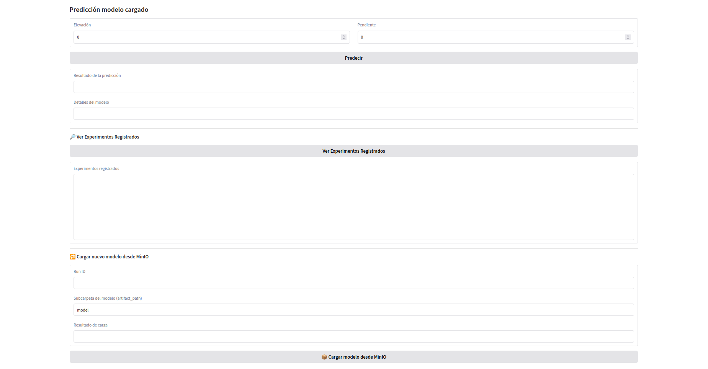

```markdown
# 🚀 MLflow API + Gradio - Inferencia y Gestión de Modelos

Este proyecto implementa una solución completa de despliegue de modelos con **MLflow**, integrando:

- 🔧 Una **API FastAPI** para inferencia y gestión de modelos
- 💡 Una **interfaz Gradio** para probar predicciones fácilmente
- 📦 Conexión con **MinIO** para carga directa de modelos
- 🐳 Despliegue con Docker + Docker Compose

---

## 📂 Estructura del Proyecto

```
mlflow-api/
│── Dockerfile                   # Imagen base para la API + Gradio
│── docker-compose.yml           # Orquestación de servicios
│── requirements.txt             # Librerías necesarias
│── .env                         # Variables de entorno
│── start.sh                     # Script de arranque (API + Gradio)
│
│── app/
│   ├── main.py                  # FastAPI con endpoints REST
│   ├── interface.py             # Interfaz visual Gradio
│   ├── inference.py             # Lógica para predicción y carga de modelos
│   ├── register.py              # Script auxiliar para registrar modelos
│   ├── __init__.py              # Inicializador del módulo
```

---

## 📌 Funcionalidades

✅ Carga de modelos desde **MLflow Registry** o directamente desde **MinIO**  
✅ Predicciones vía API o Gradio  
✅ Carga dinámica de modelos mediante `run_id`  
✅ Consulta de experimentos y ejecuciones (runs)  
✅ Visualización y test interactivo con Gradio  
✅ Despliegue rápido con Docker

---

## 🔧 Requisitos

- Docker y Docker Compose
- Acceso a un servidor MLflow y MinIO (puede ser externo)
- Python 3.10+ (solo si ejecutas localmente sin Docker)

---

## ⚙️ Configuración

Edita el archivo `.env` con los valores adecuados:

```env
MLFLOW_TRACKING_URI=http://10.43.101.184:5000
MLFLOW_S3_ENDPOINT_URL=http://10.43.101.184:9000
AWS_ACCESS_KEY_ID=admin
AWS_SECRET_ACCESS_KEY=supersecret
```

---

## 🚀 Despliegue

```bash
sudo docker-compose up -d --build
```

---

## 🌐 Acceso a la App

| Servicio       | URL                     |
|----------------|--------------------------|
| API FastAPI    | http://localhost:8000/docs |
| Interfaz Gradio| http://localhost:8503     |

---

## 🔍 Endpoints REST disponibles

### ✅ Estado de la API
```
GET /
```

### ✅ Predicción
```
POST /predict/
{
  "features": [1000, 5.5]
}
```

### ✅ Listar modelos registrados
```
GET /models
```

### ✅ Obtener detalles de experimento
```
GET /experiment/{experiment_name}
```

### ✅ Obtener detalles de una ejecución
```
GET /run/{run_id}
```

### ✅ Cargar modelo desde MinIO
```
GET /load-model-from-minio/{run_id}?artifact_path=model&experiment_id=5
```

---

## 🧪 Interfaz Gradio

La interfaz web permite:

- Cargar un modelo desde MinIO
- Especificar `run_id` y `artifact_path`
- Ingresar valores para predicción
- Ver detalles del modelo y métricas
- Explorar experimentos disponibles

Accede a:  
```
http://localhost:8503
```

---

## 🔍 Internamente

### Carga desde MinIO

```python
model = load_model_from_minio(run_id, artifact_subpath="model", experiment_id="5")
```

### Realizar predicción

```python
def make_prediction(model, input_data):
    if model is None:
        return {"error": "No hay modelos disponibles"}
    prediction = model.predict(input_data)
    return {"prediction": prediction.tolist()}
```

---

## 📌 Ejemplo visual en MinIO

Ruta típica de un modelo en MinIO:
```
artifacts/{experiment_id}/{run_id}/artifacts/model/MLmodel
```

---

## 🎯 Conclusión

Este proyecto facilita el consumo de modelos en entornos de producción, integrando tecnologías modernas como:

- 🧪 MLflow para gestión de modelos
- ☁️ MinIO para almacenamiento de artefactos
- 🚀 FastAPI para una API ligera y extensible
- 💡 Gradio para visualización interactiva