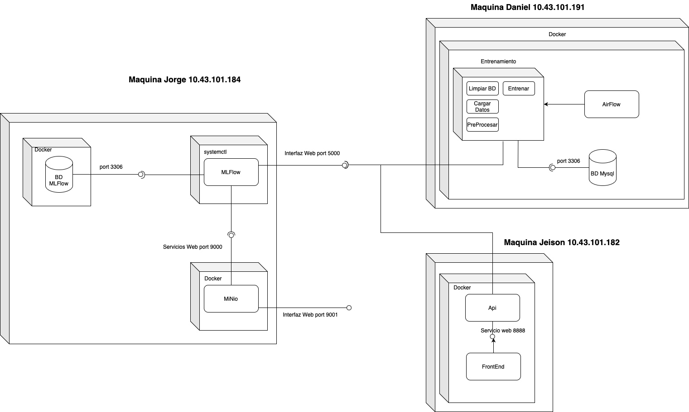

# 🧠 Proyecto MLOps con Airflow, MLflow y Docker

Este proyecto implementa un pipeline completo de MLOps que incluye:

- Extracción y carga de datos en MySQL
- Limpieza y transformación de datos con Airflow
- Ingeniería de características
- Entrenamiento y evaluación de modelos con MLflow
- Registro y versionamiento de modelos

---

## 🏗️ Arquitectura General

